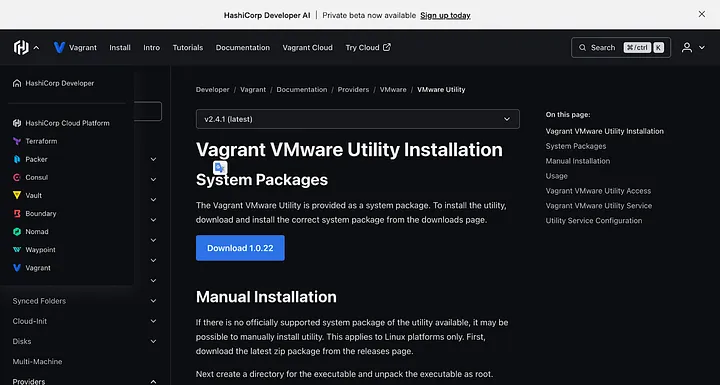
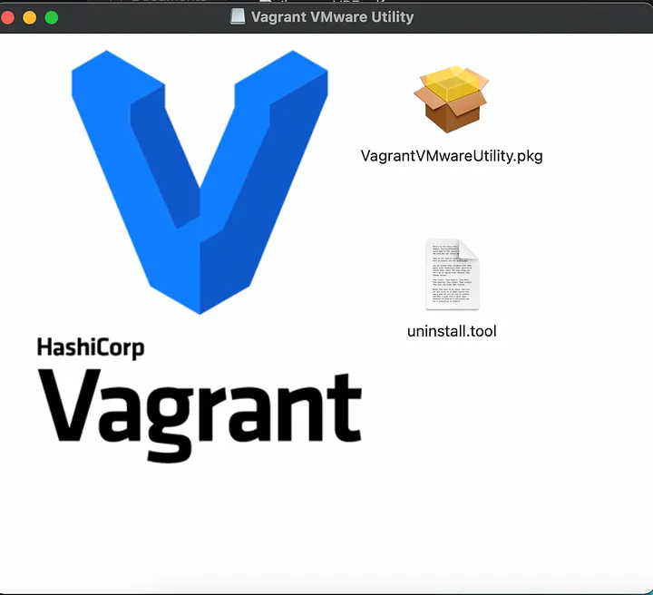
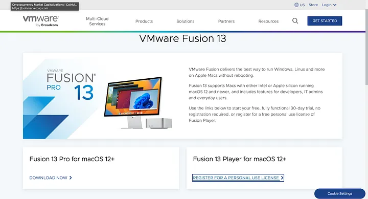
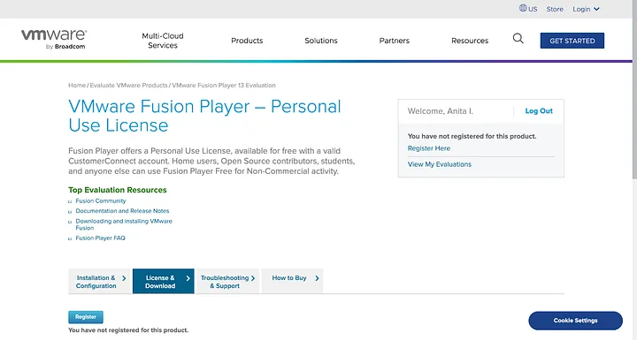
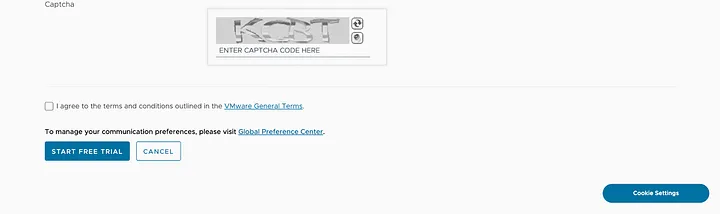
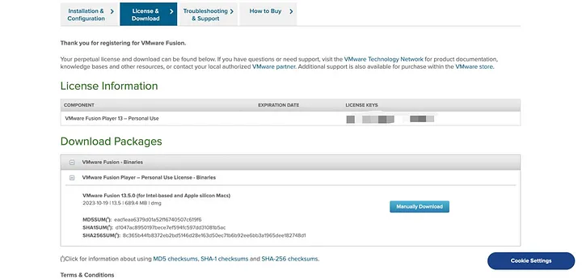
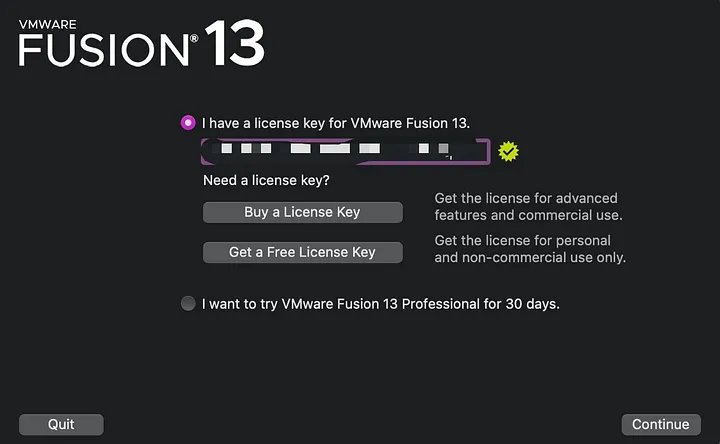
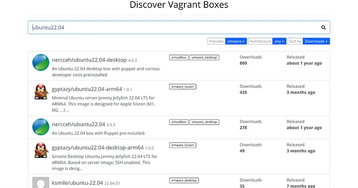
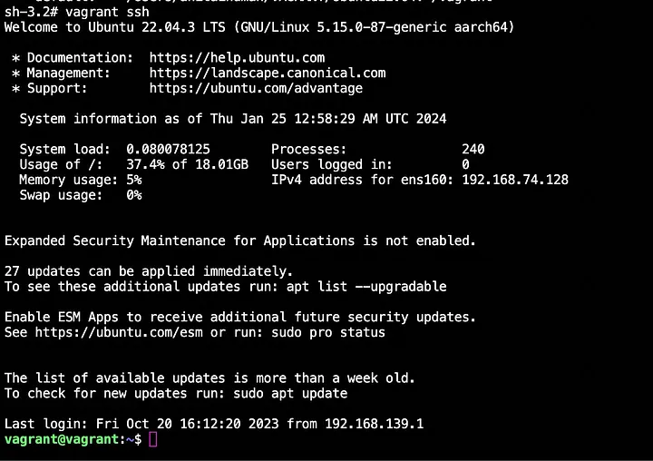

# Tarot Project Outline

Tarot-root

- backend

   - .venv (virtualenv for this project)
   - config (Configuration for development)
   - instance (where .db are being stored; either tarot.db or test.db)
   - routes (subdirectory should contain mapping files)
   - requirements.txt(python module installation for virtualenv)
   - app.py (main instigator)
   - models.py (database table definitions ORM style)
   - extensions.py (export db from there )
   - tests (Unit tests live there)

- frontend

   - Under construction

## to create the virtual environment

python3 -m venv .venv
source .venv/bin/activate
pip install -r requirements.txt

Prompt: `(.venv)`

```sh
source .venv/bin/activate
cd backend
pip3 install -r requirements.txt
```

## To create the documentation

This will be created in the `tarot/backend/docs`

```sh
source .venv/bin/activate
cd backend
pdoc ./*.py routes tests -o ./docs
```

## To run the flask code

```sh {"language":"sh","promptEnv":"never"}
source .venv/bin/activate
cd backend
flask run
```

## To test the flask code

```sh {"background":"false","language":"sh"}
source .venv/bin/activate
# cd backend
pytest -v -o log_file=test-tarot.log
```

### Pytest Coverage

```sh
source .venv/bin/activate
pytest --cov . --cov-config backend/.coveragerc.ini -cov-report=html
```

### pyTest Continuous

```sh
source .venv/bin/activate
# cd backend
pytest -v --cov-config backend/.coveragerc.ini -o log_file=test-tarot.log
ptw
```

## VUE essentials

### Debugging

It is essential that we run two processes when we are debugging the Vue portion of the code. If you have `axios` calls active in your Vue environment, You will need to start the flask debugger "Python Debugger: Flask".

To debug in Vue

Starts npm with `Run npm start - tarot` which just starts Vue with `run dev` which in turn starts a fork of another process that is runnning as the debugger

- Run Script: dev
   Select from Run and Debug

```json
{
    "command": "npm run dev",
    "name": "Run npm dev - tarot",
    "request": "launch",
    "type": "node-terminal",
    "cwd": "${workspaceFolder}/frontend/src"
}
```

Start the chrome web server by running the `Launch Chrome Vue - tarot`

```json
{
    "name": "Launch Chrome Vue",
    "type": "chrome",
    "request": "launch",
    "url": "http://localhost:4000",
    "webRoot": "${workspaceFolder}/src",
    "sourceMapPathOverrides": {
        "webpack:///src/*": "${webRoot}/*",
        "webpack:///./src/*": "${webRoot}/*",
        "webpack:///*": "${webRoot}/*"
    }
}

Now you should be able to track errors in real time with the stack levels

> The name of the files that have been compiled for this debugging run will appear in the stack trace on the side. Use those files to set breakpoints in the debugger.


```

## Installing Vagrant on M2 chip for Apple OS


Step 1: Install vagrant

```json
brew tap hashicorp/tap
brew install hashicorp/tap/hashicorp-vagrant
```

### Step 2 Download and Install VMWARE UTILITY
Download the [Vmware utility installer on Vagrant](https://developer.hashicorp.com/vagrant/install/vmware). After downloading the file, double-tap the pkg file, follow the prompt, and install it.




Run the command below in your termijnal to install the Vmware-desktop plugin when it is successfully installed

```json
vagrant plugin install vagrant-vmware-desktop
```

## Step 3 DOWNLOAD AND INSTALL VISION FUSION
Head over to the vmware [website](https://www.vmware.com/products/fusion/fusion-evaluation.html) and register for a personal license use.




Fill in your details and click on "Start a Free Trial"



Copy your license key on the new page, then manually download and install the VMware Fusion app.


enter license key


### Step 4: INSALLING AN OS BOX
Visit the official vagrant boxes [website](https://app.vagrantup.com/boxes/search) and get an OS box. I’ll recommend [gyptazy/ubuntu22.04-arm64](https://app.vagrantup.com/gyptazy/boxes/ubuntu22.04-arm64). It’s an LTS version, stable, and has been tested on multiple m1/m2 Macbooks.



Run the command below on your terminal to initialize the vagrant file; creating a directory is advisable to easily track the location of the vagrant file

```sh
vagrant init gyptazy/ubuntu22.04-arm64
vagrant up
```



To learn more about how to use Vagrant, here is their [documentation](https://developer.hashicorp.com/vagrant/docs?ajs_aid=0db20f00-bc78-42ae-a96f-8034f100ad0b&product_intent=vagrant)
