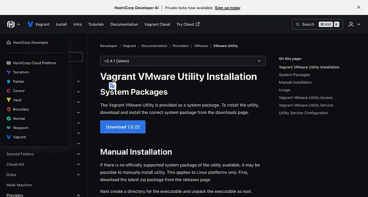
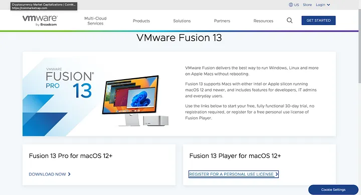
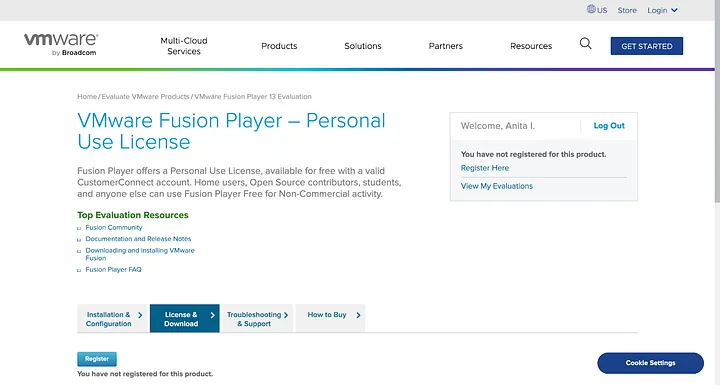
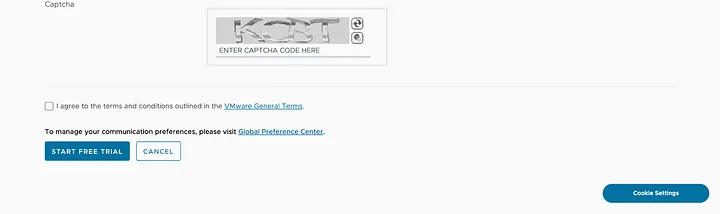
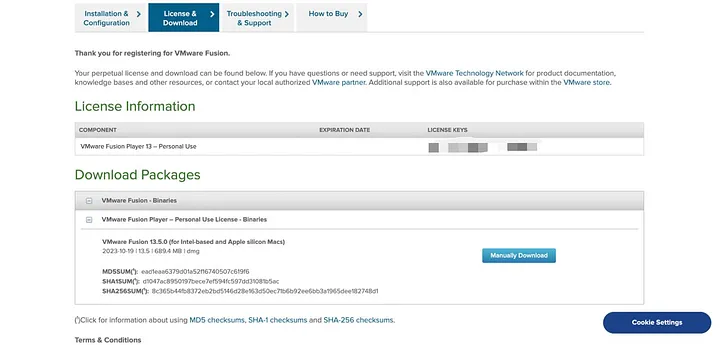

## Installing Vagrant on M2 chip for Apple OS

[ Installing Virtual environment for Ansible and Terraform molecule testing ](./docs/vagrant.md)

### Step 1: Install vagrant

```json
brew tap hashicorp/tap
brew install hashicorp/tap/hashicorp-vagrant
```

### Step 2 Download and Install VMWARE UTILITY

Download the [Vmware utility installer on Vagrant](https://developer.hashicorp.com/vagrant/install/vmware). After downloading the file, double-tap the pkg file, follow the prompt, and install it.




Run the command below in your termijnal to install the Vmware-desktop plugin when it is successfully installed

```json
vagrant plugin install vagrant-vmware-desktop
```

## Step 3 DOWNLOAD AND INSTALL VISION FUSION

```json

```

Head over to the vmware [website](https://www.vmware.com/products/fusion/fusion-evaluation.html) and register for a personal license use.




Fill in your details and click on "Start a Free Trial"



Copy your license key on the new page, then manually download and install the VMware Fusion app.


Enter license key


### Step 4: INSALLING AN OS BOX

Visit the official vagrant boxes [website](https://app.vagrantup.com/boxes/search) and get an OS box. I’ll recommend [gyptazy/ubuntu22.04-arm64](https://app.vagrantup.com/gyptazy/boxes/ubuntu22.04-arm64). It’s an LTS version, stable, and has been tested on multiple m1/m2 Macbooks.


Run the command below on your terminal to initialize the vagrant file; creating a directory is advisable to easily track the location of the vagrant file

```sh
vagrant init gyptazy/ubuntu22.04-arm64
vagrant up

```


To learn more about how to use Vagrant, here is their [documentation](https://developer.hashicorp.com/vagrant/docs?ajs_aid=0db20f00-bc78-42ae-a96f-8034f100ad0b&product_intent=vagrant)
